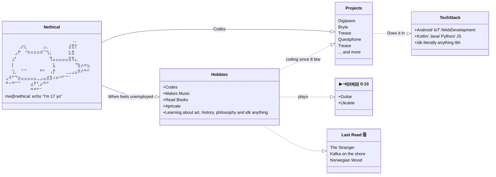

```mermaid
classDiagram
    direction LR
    class Nethical {
⠀⠀⠀⠀⠀⠀⠀⠀⠀⠀⠀⠀⠀⠀⠀⠀⠀⠀⠀⠀⠀⢀⡀⠀⠀⠀⠀
⠀⠀⠀⠀⢀⡴⣆⠀⠀⠀⠀⠀⣠⡀⠀⠀⠀⠀⠀⠀⣼⣿⡗⠀⠀⠀⠀
⠀⠀⠀⣠⠟⠀⠘⠷⠶⠶⠶⠾⠉⢳⡄⠀⠀⠀⠀⠀⣧⣿⠀⠀⠀⠀⠀
⠀⠀⣰⠃⠀⠀⠀⠀⠀⠀⠀⠀⠀⠀⢻⣤⣤⣤⣤⣤⣿⢿⣄⠀⠀⠀⠀
⠀⠀⡇⠀⠀⠀⠀⠀⠀⠀⠀⠀⠀⠀⠀⣧⠀⠀⠀⠀⠀⠀⠙⣷⡴⠶⣦
⠀⠀⢱⡀⠀⠉⠉⠀⠀⠀⠀⠛⠃⠀⢠⡟⠀⠀⠀⢀⣀⣠⣤⠿⠞⠛⠋
⣠⠾⠋⠙⣶⣤⣤⣤⣤⣤⣀⣠⣤⣾⣿⠴⠶⠚⠋⠉⠁⠀⠀⠀⠀⠀⠀
⠛⠒⠛⠉⠉⠀⠀⠀⣴⠟⢃⡴⠛⠋⠀⠀⠀⠀⠀⠀⠀⠀⠀⠀⠀⠀⠀
⠀⠀⠀⠀⠀⠀⠀⠀⠛⠛⠋⠁⠀⠀⠀⠀⠀⠀⠀⠀⠀⠀⠀⠀⠀⠀⠀

        me@nethical: echo "I'm 17 yo" 
    }
    class Projects {
        Digipaws
        Bryte
        Trease
        Questphone
        Trease
        ... and more
    }
    class Hobbies {
        +Codes
        +Makes Music
        +Read Books
        +Apricate
        +Learning about art, history, philosophy and idk anything
    }

    class Music["▶︎ •၊၊||၊|။||||| 0:10"] {
        +Guitar
        +Ukulele
    }
    class TechStack {
        +Android/ IoT /WebDevelopment
        +Kotlin/ Java/ Python/ JS
        +idk literally anything tbh
    }

    class LastRead["Last Read 🗒"] {
        The Stranger
        Kafka on the shore
        Norwegian Wood
    }

    Nethical --|> Projects : Codes
    Nethical --|> Hobbies : When feels unemployed

    Projects ..|> TechStack : Does it in
    Hobbies ..|> Projects : coding since 8 btw 
    Hobbies ..|> Music : plays
    Hobbies ..|> LastRead
```
